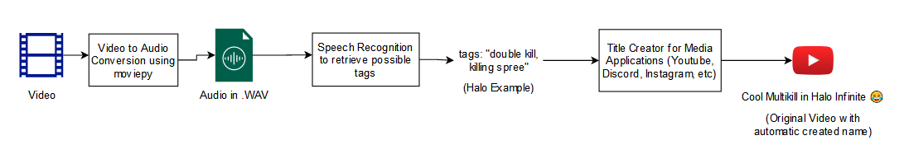
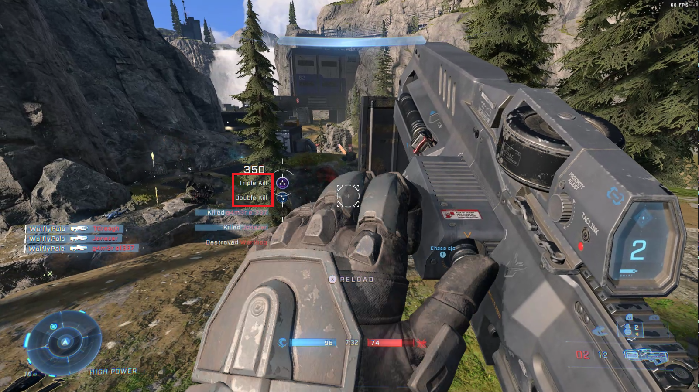

# Automatic Text and Speech Recognition on Gaming Clips

This short repository (in development) contains the new feature for my Automatic Video Uploader project. This new feature (speech recognition subtask) can be explained by the following diagram: 

Another idea that I have in mind for easier keyword build/extraction, is to detect the text that is used by the game in order to see if a certain event/highlight occurred. For example, in Halo Infinite, recognizing a Double Kill, Killing Spree (Multikill) are events that I would like to showcase and also use their names in order to automatically create the name of the video (as the example in the diagram above). With a text detection algorithm, I should be able to retrieve the text as in the picture below:

## Goal

The goal of this project is to test/research state-of-the-art algorithms to perform speech and text recognition on gaming clips and then use the keywords found to create an automatic possible funny/attractive title for the video in Youtube. 